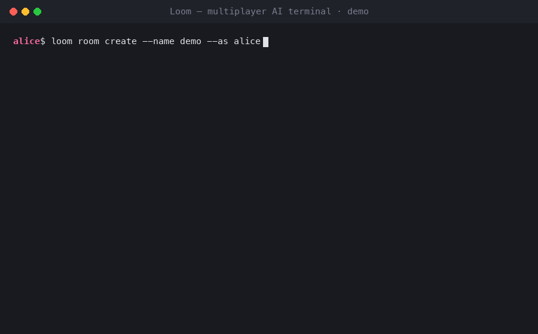

# Loom — connect your agents, and your teammates

*(GIF above: two peers, one machine, zero babysitting — a handoff sent while the recipient is offline still lands safely in her inbox.)*

---

## 30초 요약

**Loom**은 서로 다른 코딩 에이전트(Claude Code, Codex, Grok…)를 쓰는 여러 사람이 하나의 **Room**에 모여 작업을 주고받는 멀티플레이어 레이어입니다. 에이전트를 새로 만드는 게 아니라, 기존 CLI들을 감싸서 **presence + offline-safe handoff inbox + MCP 도구**를 붙입니다.

> 상대가 오프라인이어도 메시지는 유실되지 않는다. 이게 제품의 전부다.

이번 주에 두 가지가 새로 나왔습니다: **Tauri 데스크톱 셸**(위 GIF와 별개로, CLI 없이 방/피어/인박스를 보는 창)과, 그걸 가능하게 한 **13라운드짜리 보안 리뷰 게이트** 전 과정.

---

## 방금 뭐가 나왔나 (v0.11.2)

- **`apps/desktop`** — 얇은 Tauri 2 데스크톱 셸. Status / Peers / Inbox(목록·claim·accept) 뷰. Board는 v1에서 의도적으로 제외.
- 기존 **sticky host**(장기 연결 데몬)의 loopback RPC를 그대로 재사용 — **새 wire protocol을 만들지 않았습니다.**
- Rust 셸이 토큰을 들고 있고, webview(화면에 그려지는 JS)는 토큰을 **절대 보지 않습니다.**
- 텍스트는 전부 `textContent`로만 렌더 — `innerHTML` 금지.

CLI 코어(위 GIF)는 이미 몇 주째 실사용 검증된 부분입니다: 방 생성 → 초대 → 오프라인 핸드오프 → 인박스 accept, 색상 코드가 붙은 피어 로스터, `[LOOM HANDOFF]` untrusted-content 배너까지 전부 실제 명령 실행 결과입니다(연출 없음).

---

## 왜 이렇게 만들었나 (스펙 하이라이트)

- **Room**: 초대 코드(`LOOM-XXXX`)로 join. Relay가 로스터 + 온라인 맵을 들고 있고, **로스터는 소켓 연결과 분리**돼 있어서 — 오프라인이어도 인박스는 살아있습니다.
- **Handoff**: `@name` / `id` / `*` 대상 큐잉. `queued → notified → accepted|claimed` 상태 전이, **first-wins**(사람이 먼저 accept하든 에이전트가 먼저 claim하든 하나만 확정).
- **MCP**: 에이전트는 `check_handoffs` / `claim_handoff` / `handoff` / board·pack 도구로 풀(pull) 방식만 사용 — 푸시 환상 없음.
- **보안 불변식** (전 채널에 강제): 모든 peer-controlled 문자열(본문/이름/방 이름/handoff id) allowlist sanitize, 토큰·시크릿 타이밍세이프 비교, non-loopback bind는 토큰 없이 거부(fail-closed), per-peer rejoin secret으로 신원 탈취 방지.

---

## 어떻게 검증했나 — "그냥 만든 게 아니다"

`docs/PLAN.md`(단일 계획 원본)를 버전마다 갱신하고, 매 MINOR/보안 변경마다 `docs/plan_review.md`에 독립 리뷰(R1부터 지금 R13까지)를 거칩니다. 이번 데스크톱 셸도:

1. **코드가 한 줄도 없는 상태에서** 계획서만으로 먼저 리뷰를 받았고,
2. 리뷰에서 실제 문제 2건을 **구현 전에** 잡아냈습니다 — Board가 sticky RPC에 없는데 계획엔 있다고 써놨던 것, 그리고 **"sanitize 재사용"이라는 표현이 HTML escape와 혼동될 위험**(터미널용 sanitize는 `` 같은 페이로드를 그대로 통과시킵니다 — XSS 클래스 버그를 코드 한 줄 안 쓰고 잡은 경우).
3. 두 문제를 계획서에 **먼저 못 박고**(0.11.1) 그 다음에야 구현했습니다(0.11.2).

이 프로세스가 지금까지 12번의 이전 라운드에서 실제 버그를 반복적으로 잡아왔습니다: 오프라인 피어에게 메시지가 안 가던 문제, 세션 파일 덮어쓰기, 타이밍 공격 가능한 토큰 비교, identity takeover, 그리고 이번 라운드처럼 "한 채널에서 고친 sanitize가 다른 채널(desktop webview)에서 재발"하는 패턴까지.

---

## 지금 상태 / 아직 아닌 것

**됨:**
- 로컬/원격 멀티플레이어 room, 오프라인-세이프 인박스, Claude/Codex/Grok 어댑터 + MCP
- 토큰 인증 원격 relay(fail-closed), sticky host, context pack, task board(+ 스냅샷 공유)
- per-peer rejoin secret — 토큰+초대코드만으로 남의 신원을 뺏을 수 없음
- 얇은 Tauri 데스크톱 셸(Status/Peers/Inbox)

**아직 아님 (의도적 제외):**
- 데스크톱 Board 뷰 (v2 후보)
- 실시간 멀티라이터 board CRDT
- 에이전트 TUI를 데스크톱에 임베드 (PTY 주입은 스파이크 결과 no-go)
- 클라우드 계정/멀티테넌시 — 지금은 로컬-퍼스트

---

## 다음 / 요청

- 데모 써보고 피드백 주세요 — 특히 오프라인 핸드오프 체감, 데스크톱 셸 첫인상.
- 다음 후보: 데스크톱 Board, 라이브 relay board sync.
- 코드/스펙: [`README.md`](../README.md) · [`docs/PLAN.md`](./PLAN.md) (버전 이력 전체) · [`docs/plan_review.md`](./plan_review.md) (R1–R13 보안 리뷰 전문) · [`apps/desktop/README.md`](../apps/desktop/README.md)

---

*Slack에 붙여넣을 때: 위 GIF(`docs/loom-demo.gif`)를 파일로 첨부하고, 이 문서 본문을 메시지로 붙여넣으면 GIF가 스레드 맨 위 미리보기로 뜨고 그 아래 설명이 붙는 형태가 됩니다.*
